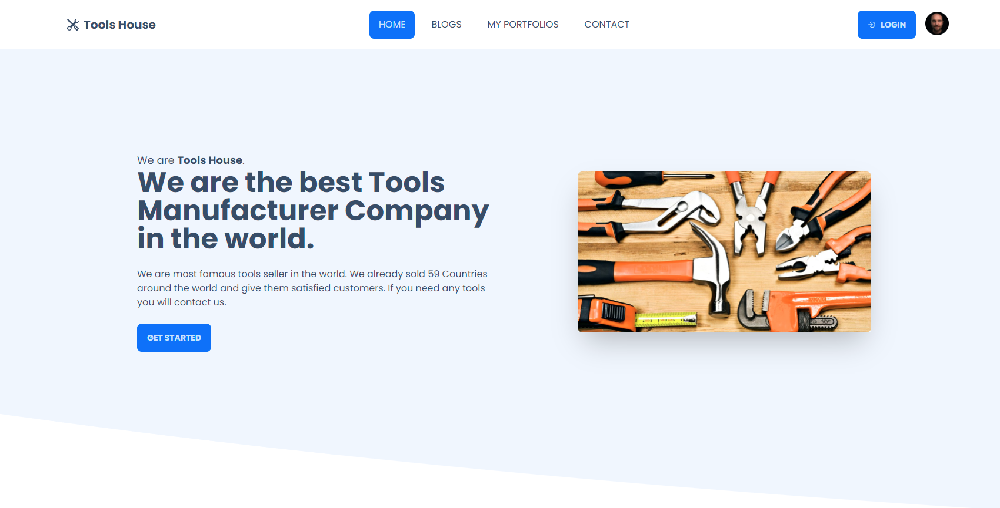

# Tools Houses

This is tools house application for selling tools around the world. you can purchase any of the tools here in wholesale prices. For more information get the future versions.

# Here Additional Links

### Client Preview Link [Click Here](https://tools-manufactures.web.app/)

### Server Link [Click Here](https://github.com/programming-hero-web-course1/manufacturer-website-server-side-Ashik-Mahmud)

---

## Using Technologies

- React js
- React router dom
- Firebase
- React Hook form
- Tailwind Framework with Daisy UI Component
- React Query
- React Icons
- react-countup
- react-hot-toast
- react-reveal
- react-slick"
- react-spinners
- react-stars
- sweetalert2
- React Stripe

These are technologies which one use to create this application.

## Features

---

- Here users can login and create account using Google Account and also user can create account via email and password and also users can reset their email.
- users can create order after login in this application and also can handle their own order of this application.
- users get the dashboard after login in this application and there users can management their own all the activities.

- Here is two portion for difference role like users can see the some of features of dashboard on the other hand admin can see the control of all the things has in application.
- Here has two system of adding product image via upload from local computer and and other is via URL
- After every placed order users will received an email from application and also receiving email after paid the particular product.
- Nobody can't exceed the product minimum order quantity and available stock it should be in between them. if You customer try to over of this range it will show them error message.
- I just allow people to pay with Card Like VISA, MASTER etc.
- Implementing comments options where users can comment the particular post after login this application.

### Admin

- Admin can create a brand new product and also can manage this like add, delete, update(under construction)
- Admin can see the all order management route which one shows all the orders which makes user on our application.
- Admin also can make other users admin by clicking on make admin button
- Admin can change the status after user payment of the product shipped to delivery
- Admin can update the particular product stock
- Admin can cancel the order if user not paid after paid admin can't canceled the orders

### User

- User can makes order with details email on their email which one registered this application.
- user can pay with other page using their Card
- user can cancel their own order before payment after payment user can get this option canceled the order. we sent the email after payment with refund policy.
- Users can create review of our company from their experiences.
- user can see the payment history

### Both

- Both are see the profile page for their own information here both can update their own information with real time update.
- Both are see the Blog Management page where they can create brand new blog
- Both are also can manage the blog like delete, update, and also has the features of counting views and comments
- Both are see the dashboard where just see the welcome images.

---

## Here is Live Link of This application <https://tools-manufactures.web.app/>

---

## Demo Preview of this application



---

## Here is Admin login Information

```
 Email - admin@admin.com
 password - admin187
```

> Thanks for reach out me on the github.com.
